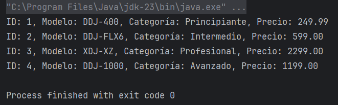

# Conexión a Bases de Datos Relacionales con JDBC y Scala

## 1. ¿Qué es JDBC y cuáles son sus componentes?

JDBC (Java Database Connectivity) es una API de Java que permite que nuestras aplicaciones se conecten e interactúen con bases de datos relacionales. Es un puente entre nuestro código Java y la base de datos, haciendo que trabajar con SQL desde Java sea mucho más sencillo.

### Componentes principales:

- **DriverManager:** Este componente se encarga de gestionar los controladores JDBC y establecer las conexiones con las bases de datos.
- **Connection:** Representa una conexión activa a la base de datos. Con ella podemos enviar consultas SQL y realizar transacciones.
- **Statement:** Sirve para ejecutar sentencias SQL. Tiene variantes como `PreparedStatement` (más eficiente para consultas repetidas) y `CallableStatement` (para procedimientos almacenados).
- **ResultSet:** Es el contenedor que almacena los resultados de una consulta SQL y nos permite acceder a ellos de manera ordenada.

---

## 2. Librerías de Scala para conectarse a bases de datos relacionales

En Scala, existen varias opciones para interactuar con bases de datos. Dos de las más populares son **Slick** y **ScalikeJDBC**. A continuación, una comparativa:

| Característica             | **Slick**                                                                                 | **ScalikeJDBC**                                                    |
|----------------------------|-----------------------------------------------------------------------------------------|--------------------------------------------------------------------|
| **Estilo**                 | Usa un enfoque funcional, similar a un ORM.                                             | Es más cercano al acceso directo con JDBC y SQL.                  |
| **Tipado**                 | Sistema de tipos fuerte, detecta errores en tiempo de compilación.                      | Aunque también es tipado, permite escribir SQL más libremente.     |
| **Curva de aprendizaje**   | Más compleja debido a su estilo funcional.                                              | Más sencilla, ideal si estás familiarizado con SQL y JDBC.        |
| **Flexibilidad**           | Muy buena para construir consultas complejas funcionalmente.                             | Excelente para escribir SQL personalizado sin restricciones.      |
| **Integración**            | Se integra bien con otras herramientas del ecosistema Scala.                             | Se especializa en simplificar el uso de JDBC para proyectos Scala. |

---

## 3. Ejemplo: Conexión a una base de datos MySQL desde Scala

A continuación, se detalla el proceso completo para conectarse a una base de datos MySQL, usando una como ejemplo, una tabla personalizada con modelos de controladores DJ de Pioneer.

### a. Crear la base de datos y tabla en MySQL

```sql
-- 1. Crear una base de datos llamada controladoresDJ
CREATE DATABASE controladoresDJ;

-- 2. Seleccionar la base de datos
USE controladoresDJ;

-- 3. Crear una tabla para almacenar modelos de controladores DJ
CREATE TABLE controladores_dj (
    id INT AUTO_INCREMENT PRIMARY KEY,
    modelo VARCHAR(50) NOT NULL,
    categoria VARCHAR(50),
    precio DECIMAL(10, 2)
);

-- 4. Insertar datos en la tabla
INSERT INTO controladores_dj (modelo, categoria, precio) VALUES
('DDJ-400', 'Principiante', 249.99),
('DDJ-FLX6', 'Intermedio', 599.00),
('XDJ-XZ', 'Profesional', 2299.00),
('DDJ-1000', 'Avanzado', 1199.00);
```
### b. Conectar Scala a MySQL y consultar los datos
#### 1. Agregar dependencias en 'build.sbt'
``` Scala
libraryDependencies ++= Seq(
  "mysql" % "mysql-connector-java" % "8.0.32",
  "org.scalikejdbc" %% "scalikejdbc" % "4.0.0",
  "org.slf4j" % "slf4j-simple" % "1.7.36" // Dependencia para manejar los logs generados
)
```
#### 2. Escribir el código en Scala
```Scala
import scalikejdbc._

object EjemploControladoresDJ extends App {

    // Configurar el driver y la conexión
    Class.forName("com.mysql.cj.jdbc.Driver")
    ConnectionPool.singleton("jdbc:mysql://localhost:3306/controladoresDJ", "root", "My5qlr007p455")

    // Iniciar sesión con ScalikeJDBC
    implicit val session = AutoSession

    // Realizar una consulta a la tabla de controladores DJ
    val controladores = sql"""
      SELECT * FROM controladores_dj
    """.map(rs => (
      rs.int("id"),
      rs.string("modelo"),
      rs.string("categoria"),
      rs.bigDecimal("precio")
    )).list.apply()

    // Mostrar los resultados
    controladores.foreach { case (id, modelo, categoria, precio) =>
      println(s"ID: $id, Modelo: $modelo, Categoría: $categoria, Precio: $precio")

  }
}
```
#### 3. Ejecutar el programa
Captura de ejecución:



## Bibliografía:

- Tech Lib. (2023, mayo 17). Java Database Connectivity (JDBC) - Definición y explicación. Recuperado de https://techlib.net/techedu/java-database-connectivity-jdbc/?utm_source=chatgpt.com
- Mendoza, D. (2020). Slick | Librería de Scala para trabajar bases de datos relacionales [Video]. YouTube. Recuperado de https://youtu.be/yA5ormu6knc
- KeepCoding. (2023). ¿Qué es JDBC (Java Database Connectivity)?. Recuperado de https://keepcoding.io/blog/jdbc-java-database-connectivity/?utm_source=chatgpt.com
